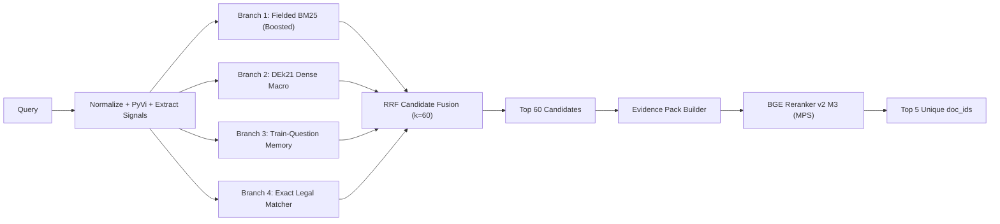

# Technical Design Specification: Clean LegalIR High-Output Pipeline

- **Date**: 2026-08-30
- **Task**: UIT-DSC 2026 Task 1 — Legal Information Retrieval (LegalIR)
- **Status**: Approved for Implementation

---

## 1. Goal & Architecture Overview

The objective is to deliver a clean, standardized LegalIR workspace matching the architecture of Task 2 (`LegalQA - Public Test`), while maximizing the primary competition metric: **Recall@5** (with **Precision@5** as secondary) on the official 1,000 public test queries.

### Clean Workspace Layout:
```text
LegalIR - Public Test/
├── configs/
│   ├── models.yaml               # Model repository IDs, revisions, dimensions
│   ├── task1.yaml                # Task 1 retrieval & reranking hyperparameters
│   └── pipeline.yaml             # Unified pipeline configuration
├── src/
│   ├── common/                   # Shared RAG core (matching Task 2 layout)
│   │   ├── normalize.py          # Legal cleaning, PyVi segmentation, entity extraction
│   │   ├── legal_parser.py       # Vietnamese legal hierarchy parser
│   │   ├── bm25.py               # Fielded BM25 with exact legal entity boosting
│   │   ├── dense_dek21.py        # DEk21 v2 dense embeddings on MPS/CPU
│   │   ├── rrf.py                # Reciprocal Rank Fusion
│   │   ├── evidence.py           # Multi-chunk structured evidence pack builder
│   │   └── reranker.py           # BGE-Reranker-v2-M3 cross-encoder batch inference
│   └── task1/                    # Task 1 specific modules
│       ├── memory.py             # Fold-isolated Train-Question Memory (TF-IDF + DEk21)
│       ├── retrieve.py           # 4-Branch candidate search engine
│       ├── rerank.py             # Document-level evidence reranking
│       ├── selector.py           # Top-5 unique document ID selector
│       └── predict.py            # End-to-end LegalIRPipeline class
├── artifacts/
│   └── task1/
│       ├── data/                 # documents.parquet, chunks.parquet, queries/qrels
│       ├── indexes/              # bm25s / bm25_meta, dense_dek21 vectors, memory
│       └── submissions/          # submission.json, submission.zip
├── scripts/
│   ├── 01_build_dataset.py       # Builds canonical dataset from raw ZIP
│   ├── 02_build_indexes.py       # Precomputes BM25 & DEk21 embeddings on MPS
│   ├── 03_run_benchmark.py       # Dual validation (5-fold CV & Doc-Disjoint)
│   ├── 04_predict_submission.py  # Generates real DEk21 + BGE Reranker submission.zip
│   └── audit_parameters.py       # Confirms parameter compliance (<4.0B)
├── tests/                        # Clean test suite for common + task1
├── requirements.txt
└── README.md
```

---

## 2. Model Stack & Parameter Audit

| Component | Model / Method | Parameter Count | Device / Runtime |
| :--- | :--- | :---: | :---: |
| **Lexical** | Fielded BM25 with Legal Signal Boosting | 0 | CPU / NumPy |
| **Dense Retriever** | `CODE4LIFEOFFICIAL/huydang-dek21-embedding-v2` | ~135M (~0.135B) | Apple Silicon `mps` / CPU |
| **Question Memory** | TF-IDF (char n-grams) + DEk21 Embeddings | 0 (reuses DEk21) | CPU / NumPy |
| **Exact Matcher** | Deterministic Legal Regex Parser | 0 | CPU |
| **Candidate Fusion** | Reciprocal Rank Fusion ($k=60$) | 0 | CPU |
| **Cross-Encoder Reranker** | `BAAI/bge-reranker-v2-m3` | ~568M (~0.568B) | Apple Silicon `mps` / CPU |
| **Total System Parameters** | **LegalIR 4-Branch Stack** | **~0.703 Billion** | **PASS (< 4.0B ceiling)** |

---

## 3. High-Output Retrieval & Reranking Pipeline



1. **Branch 1 — Fielded BM25 with Legal Entity Boosting**:
   - Scores micro chunks with BM25.
   - Applies additive boosts for exact matches in query signals:
     - Document Number match (e.g. `5868/QĐ-BYT`): $+25.0$.
     - Article match (e.g. `Điều 10`): $+12.0$.
     - Clause match (e.g. `Khoản 2`): $+6.0$.
   - Aggregates chunk scores to document level via $\max + 0.1 \times \text{mean}$.

2. **Branch 2 — Dense DEk21 Macro**:
   - Encodes macro chunks with `CODE4LIFEOFFICIAL/huydang-dek21-embedding-v2` (768-dim, normalized) on `mps`.
   - Encodes query with PyVi word segmentation and performs cosine similarity search.

3. **Branch 3 — Train-Question Memory**:
   - Combines character n-gram TF-IDF similarity with DEk21 question embedding similarity over official `train.json` questions.
   - High-similarity neighbors vote for their gold `doc_id`s with fold isolation during CV.

4. **Branch 4 — Exact Matcher**:
   - Matches official decree/circular/law patterns (`\b\d{1,5}/\d{4}/[A-ZĐ\-]+\b`) and promulgation years.

5. **Reciprocal Rank Fusion**:
   $$RRF(\text{doc}) = \sum_{b \in \{bm25, dense, memory, exact\}} \frac{w_b}{60 + \text{rank}_b(\text{doc})}$$
   Produces Top 50–60 candidate documents.

6. **Structured Evidence Pack Builder & Cross-Encoder Reranking**:
   - Formats evidence for top candidates:
     `[QUESTION] {q} [DOCUMENT] {title} {legal_number} [EVIDENCE 1] {top_chunk_1} [EVIDENCE 2] {top_chunk_2}`.
   - `BAAI/bge-reranker-v2-m3` scores all candidate pairs in batches on `mps`.
   - Sorts by cross-encoder score and selects the Top 5 unique document IDs.

---

## 4. Dual Validation & Submission Invariants

1. **Dual Validation**:
   - 5-Fold Cross-Validation: Evaluates seen-document behavior and question memory.
   - Document-Disjoint Split: Evaluates generalization to unseen legal documents.
2. **Submission Invariants**:
   - Exactly 1,000 queries matching `public-official.json`.
   - $1 \le \text{len}(\text{answer}) \le 5$ for all queries.
   - All document IDs are strings and unique per answer.
   - All document IDs exist in the 8,532 canonical corpus.
   - `submission.zip` contains only `submission.json`.
