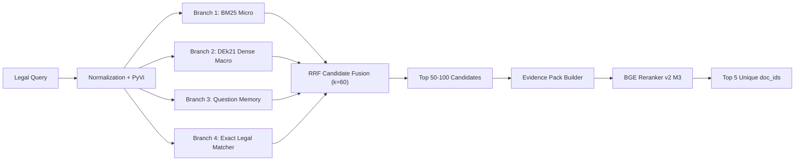

# Technical Design Specification: UIT-DSC 2026 Task 1 LegalIR Pipeline

- **Date**: 2026-08-30
- **Task**: UIT-DSC 2026 Task 1 — Legal Information Retrieval (LegalIR)
- **Status**: Approved for Implementation

---

## 1. Executive Summary & Task Contract

The goal of Task 1 is to retrieve the top relevant Vietnamese legal documents (1 to 5 unique `document_id`s) for legal queries.
- **Primary Optimization Metric**: **Recall@5** ($\text{Recall} = |\text{gold} \cap \text{pred}| / |\text{gold}|$).
- **Secondary Metric**: **Precision@5** ($\text{Precision} = |\text{gold} \cap \text{pred}| / |\text{pred}|$).
- **System Parameter Budget**: Total learned neural parameters in Task 1 must be strictly **< 4.0 Billion parameters**.
- **Data Constraints**: Strictly Task 1 official competition data only (`train.json`, `public-official.json`, `selected-contexts.zip` / `selected-contexts/`). No external legal corpus, no synthetic data augmentation, no Task 2 data. Zero external API calls.
- **Submission Output**: `submission.zip` containing `submission.json` mapping each query ID to `{"answer": ["doc_id_1", "doc_id_2", ...]}` with $1 \le \text{len}(\text{answer}) \le 5$.

---

## 2. Model Stack & Compliance Audit

| Component | Model / Method | Parameter Count | Compliance Role |
| :--- | :--- | :---: | :--- |
| **Lexical Retrieval** | Fielded BM25 on Micro Chunks | 0 | Exact terminology, numbers, acronyms |
| **Dense Retrieval** | `CODE4LIFEOFFICIAL/huydang-dek21-embedding-v2` | ~135M (~0.135B) | Semantic retrieval with PyVi segmentation |
| **Train-Question Memory**| TF-IDF + DEk21 Train Embeddings | 0 (reuses DEk21) | Near-question memory transfer with fold isolation |
| **Exact Matcher** | Deterministic Legal Regex Parser | 0 | High-confidence decree/circular/law numbers |
| **Candidate Fusion** | Reciprocal Rank Fusion ($k=60$) | 0 | Rank-based multi-branch candidate merge |
| **Cross-Encoder Reranker**| `BAAI/bge-reranker-v2-m3` | ~568M (~0.568B) | Contextual evidence discrimination |
| **Total System Budget** | **LegalIR 4-Branch Stack** | **~0.703 Billion** | **PASS (< 4.0B parameter ceiling)** |

---

## 3. Canonical Dataset Architecture (`artifacts/shared/canonical/v2/`)

The Canonical Dataset serves as the single source of truth for all retrieval indexes, training views, and validation benchmarks.

1. **`documents.parquet`** (8,532 official documents):
   - `doc_id` (string): Official document identifier.
   - `name_raw` (string): Original document title/slug.
   - `title` (string): Clean normalized title.
   - `legal_number` (string): Extracted decree/circular/law code (e.g. `5868/QĐ-BYT`).
   - `year` (int/string): Promulgation year.
   - `doc_type` (string): Legal document classification (Luật, Nghị định, Thông tư, Quyết định).
   - `passage_raw` (string): Verbatim original legal passage.
   - `passage_norm` (string): NFC Unicode and whitespace-normalized passage.
   - `is_empty` (bool): True for empty context records (audited without data loss).

2. **`chunks.parquet`** (1,153,876 dual-granularity rows):
   - `micro` (934,416 rows, 100–250 tokens): Clause (Khoản) and point (Điểm) units for fine-grained lexical BM25 matching.
   - `macro` (219,460 rows, 400–800 tokens): Article (Điều) and chapter-level contexts for DEk21 dense embeddings and cross-encoder evidence packs.

3. **`queries_train.parquet` & `qrels_train.parquet`**:
   - 7,000 queries with 7,637 exploded relevance relations ($1.0$).

---

## 4. Multi-Branch Retrieval & Fusion Pipeline

1. **Branch 1 (BM25 Micro)**:
   - Evaluates micro chunks with legal field weights: Legal Number ($5.0$), Title ($3.0$), Article ($2.0$), Body ($1.0$).
   - Document pooling: $S_{\text{doc}} = \max(S_{\text{chunk}}) + 0.1 \times \text{mean}(S_{\text{chunk}})$.
2. **Branch 2 (Dense DEk21 Macro)**:
   - `CODE4LIFEOFFICIAL/huydang-dek21-embedding-v2` generates 768-dimensional normalized embeddings on PyVi-segmented macro chunks.
   - Computes cosine similarity and aggregates top candidate documents.
3. **Branch 3 (Question Memory)**:
   - Combines character n-gram TF-IDF similarity with DEk21 question embedding similarity.
   - Votes for gold document IDs of nearest training questions with strict fold isolation to guarantee zero leakage during CV.
4. **Branch 4 (Exact Matcher)**:
   - Regex patterns match official document numbers (e.g. `\b\d{1,5}/\d{4}/(?:NĐ-CP|TT-BCA|QĐ-BYT|QH\d+)\b`), legal years, and exact statute names.
5. **RRF Aggregation**:
   $$RRF(\text{doc}) = \sum_{b \in \text{branches}} \frac{w_b}{60 + \text{rank}_b(\text{doc})}$$
   Produces Top 50–100 candidate documents for cross-encoder reranking.

---

## 5. Evidence Packs & Cross-Encoder Reranking

For each candidate document:
- The top 2 macro evidence chunks are selected.
- Format: `[QUESTION] {query} [DOCUMENT] {doc_title} {legal_number} [EVIDENCE 1] {chunk_1} [EVIDENCE 2] {chunk_2}`.
- `BAAI/bge-reranker-v2-m3` scores all candidate pairs in batches.
- Candidates are sorted by reranker score, and the Top 5 unique document IDs are extracted.

---

## 6. Dual Validation & Verification Framework

1. **Random 5-Fold Cross-Validation**:
   - Assesses general performance, seen-document recall, and Question Memory effectiveness.
2. **Document-Disjoint Split**:
   - Evaluates generalization to completely unseen legal documents where gold documents never appeared in training folds.
3. **Evaluation Metrics**:
   - Candidate Recall@20, Candidate Recall@50, Candidate Recall@100.
   - Final Recall@1, Recall@3, Recall@5, and Precision@5 computed with the official Codabench scoring script.

---

## 7. Submission Verification Criteria

Before packaging `submission.zip`:
1. Every query ID in `public-official.json` exists in `submission.json`.
2. Every prediction is a non-empty list of string document IDs.
3. $1 \le \text{len}(\text{answer}) \le 5$.
4. All document IDs in each answer are unique.
5. All predicted IDs exist in the official 8,532 document corpus.
6. Parameter count verified $< 4.0\text{B}$.
